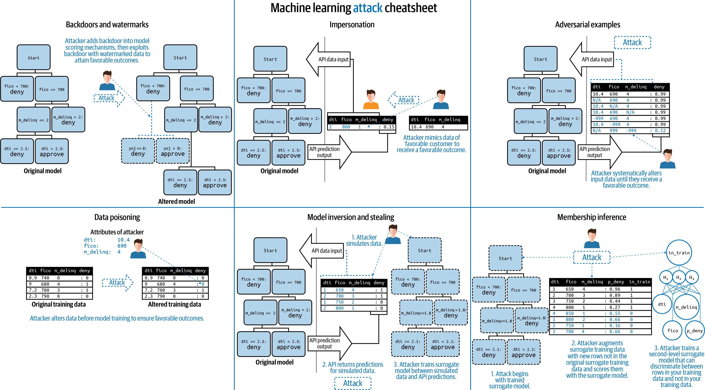

# Secure Machine Learning Ideas

See [secure_ml_ideas.pdf](secure_ml_ideas.pdf) for a drafty write-up of these attacks.

Follow-ups to the original draft include:
* [*Proposals for model vulnerability and security*](https://www.oreilly.com/ideas/proposals-for-model-vulnerability-and-security) on O'Reilly Ideas
* [*Can Your Machine Learning Model Be Hacked?!*](https://www.h2o.ai/blog/can-your-machine-learning-model-be-hacked/) on the [h2o.ai](https://www.h2o.ai) blog site.

See [main.pdf](main.pdf) for AI Risk and Security (AIRS) meetup slides.
